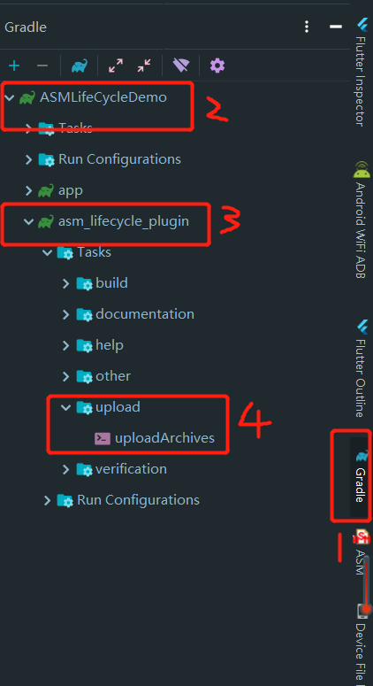
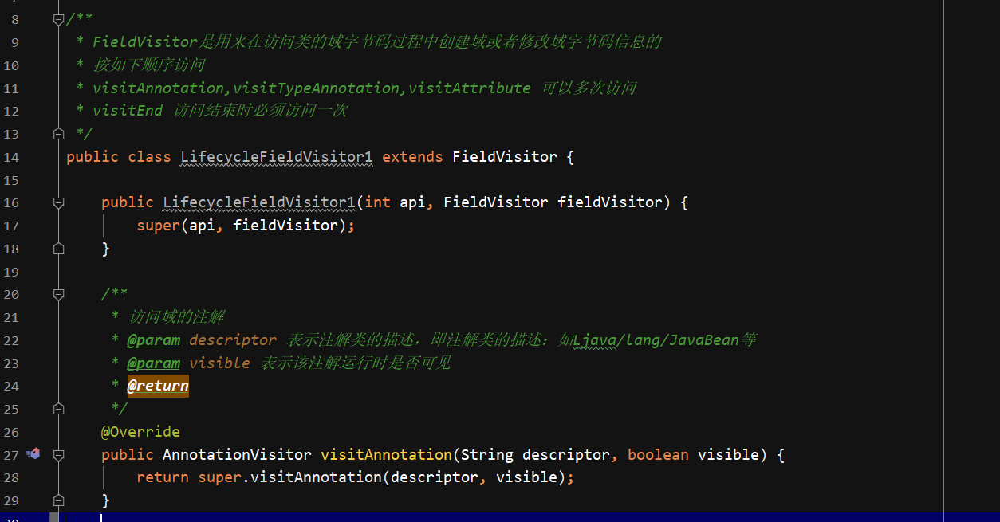

# ASMLifeCycleDemo
Android编译插桩,主要gradle plugin创建，groovy使用，Transform，ASM框架的使用

### Android编译插桩：
就是apk打包过程的class转dex阶段，gradle plugin 通过Transform来获取所以的.class文件，包括jar包中的，然后根据需求过滤出需要的.class文件，然后进行修改

### gradle plugin的创建
1.创建Android library  
2.创建完将多余的删掉，删的就剩下图的  

3. 创建groovy文件夹 创建LifeCyclePlugin.groovy 继承 Plugin<Project>
   实现apply方法，apply里实现，在app gradle执行的时候通过Task会自动加载执行
4. 创建resources - META-INF -
   gradle-plugins顺序文件夹，再其下创建com.httvc.lifecycle.properties文件
   其中输入 implementation-class=com.httvc.plugin.LifeCyclePlugin
5. 在build.gradle下加入如下代码：  
   
6. 在app gradle中加入如下代码：  
   

   注意：
   * apply plugin:'com.httvc.lifecycle' 是gradle
     plugin中properties的文件名
   * classpath：'com.httvc.plugin:asm_lifecycle_plugin:1.0.0'
     是group+module+version
   * gradle plugin
     写完需要在右边如下图Gradle中下的uploadArchives点击发布才能使用
   * 每次修改完都得点击uploadArchives，点击前需要将app gradle 中的apply
     plugin:'com.httvc.lifecycle'注释再点，不然保错，如果groovy中出现文件存在点击clean
     project后然后在点击uploadArchives再发布，然后将注释apply
     plugin去掉，sync就可以了。可以通过gradlew clean assembledebug
     来看现实的日志  
     

### transform的使用
  Transform
  是Android应用打包的过程中到.class文件打包成.dex文件之前提供的api。因此我们去实现Transform的方法，就可以去遍历所有的.class文件的所有方法，然后可以修改，再对源文件进行替换，就可以达到在源文件以及第三方文件中插入代码的目的。

  Transform:包含以下常用的几个方法
   * getName()
   * set<QualifiedContent.ContentType> getInputTypes() set<? super
   * QualifiedContent.Scope> getScopes() isIncremental()
   * transform(TransformInvocation transformInvocation)

   

   

   transform(TransformInvocation transformInvocation) ：  
   Collection<TransformInput> transformInputs =
   transformInvocation.inputs  
   TransformInput: 输入文件的集合  
   包括：  
   DirectoryInput集合 是所有源码以及第三方下的目录结构以及源文件  
   jarInput集合 是指以jar包编译的jar包和aar

   TransformOutputProvider:可以获取到输出路径等信息，最后将修改的文件复制到输出目录  
   TransformOutputProvider
   outputProvider=transformInvocation.outputProvider

注意:Gradle3.6版本之后，R文件只会编译成R.jar,所以需要transformInput.jarInputs.each{}这段代码
Gradle3.6以前不需要去遍历.jar文件，除非有需要修改的jar文件才去遍历。

处理jar和源文件的.class逻辑代码

### ASM框架

在gradle plugin的gradle中加入：
implementation 'org.ow2.asm:asm:7.1'  
implementation 'org.ow2.asm:asm-commons:7.1'

然后asm的使用及其方法都在java/com/httvc/asm下都有注解 请查看
ClassVisitor的所有方法以及参数的使用
[LifeCycleClassVisitor1.java](asm_lifecycle_plugin/src/main/java/com/httvc/asm/LifeCycleClassVisitor1.java)  
MethodVIsitor的所有方法及其参数的使用
[LifecycleMethodVisitor1.java](asm_lifecycle_plugin/src/main/java/com/httvc/asm/LifecycleMethodVisitor1.java)  
FieldVisitor的方法及其参数的使用
[LifecycleMethodVisitor1.java](asm_lifecycle_plugin/src/main/java/com/httvc/asm/LifecycleMethodVisitor1.java)

其代码上面部分代码注解截图如下：  

在lifeCyclePlugin.groovy中加入如下代码：  
`  
def android=project.extensions.getByType(AppExtension)

println'------------registering AutoTrackTransform ------------------'

LifeCycleTransform transform=new LifeCycleTransform()

android.registerTransform(transform)`

然后点uploadArchives
运行代码就可以使用了
集体实现查看其里面的代码

参考的博客如下：
https://mp.weixin.qq.com/s/KCpl0CNgwMv0CgvbadNK6A
https://www.jianshu.com/p/d8c2ada6e82f  
https://www.jianshu.com/p/dcc9ffcf9c8e

